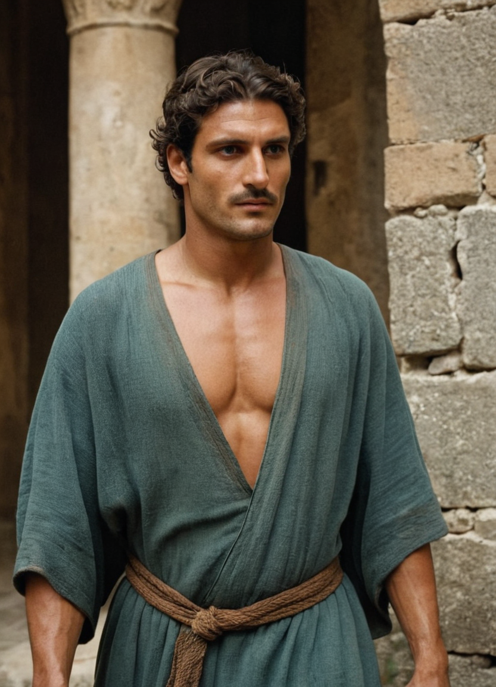
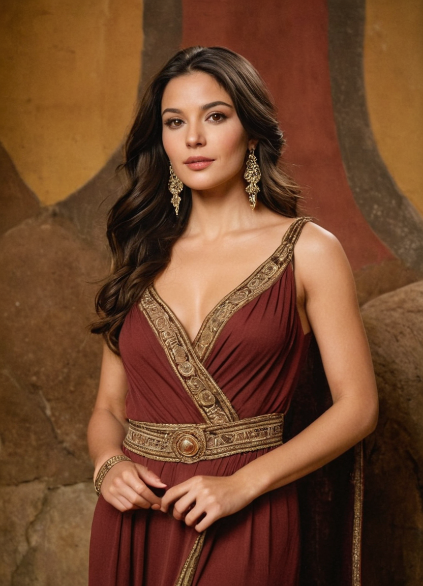

# The Atherian Empire Overview

The Atherian Empire was the great imperial civilisation of the central known world, with its capital at Caleran in the region now forming the Thalmyric heartland. Its power extended east into the lands of Eclessia, around the Thalassian Sea, towards the northern desert approaches and into the southern forest marches. Roads, aqueducts, provincial institutions and urban remains continue to shape those countries in 1360 AR.

Atherian society developed over many centuries, from southern war-settlers and maritime communities through rival city-states, a republic and hereditary empire. Citizenship eventually joined populations of different ancestry within a common political system. The empire also became the setting of the Redeemer's ministry, the persecutions of his followers and the later adoption of their faith.

## Formation and expansion

Southern households and war-settlement leagues separated gradually from the post-Glass people during c. 2130–2050 BR. Their descendants seized and repaired inhabited sites, establishing themselves through conquest, slavery, alliance, adoption and intermarriage. Sea-kings, ports, mercenary leagues and founder houses later connected several regions of recovery.

Early Atherian cities grew around defensible hills, rivers and crossings in the Caleran basin and along other coasts. The [[Peoples of the Ancient Aurin|Enathi, Serathi and Vardeni]] contributed distinct Orphaned histories to the Aurin settlements; [[Arkenan and Saronikan Cities before the Empire|the eastern island cities and harbours]] developed their own networks. Competition for grain, copper, coastal access and pilgrimage traffic encouraged both war and cooperation.

Caleran's royal households emerged from the coalition of [[Avren and Caleth]]. Later, [[Ilaron and Tarsenna]] established a shared public religious settlement drawing on maritime and inland traditions. The [[The Celestial Compact and the Caleran Republic|Celestial Compact]] joined twelve leading cities around 800 BR under a common calendar, arrangements for settling disputes and a military levy. Caleran's river, harbour and road connections made it the meeting place of the league.

The Compact developed into a republic with assemblies, a senate of property-holding houses and annually chosen magistrates. Expansion brought roads, colonies and aqueducts, supported by taxes and enslaved labour. Allies gained rights on unequal terms; other subject communities paid taxes without receiving equivalent citizenship.

Land concentration, provincial wealth and competition among commanders contributed to civil war. Around 350 BR, Aurelius Thalion seized Caleran and made his command hereditary in practice, while retaining republican offices in ceremonial form. [[The Rise of the Atherian Empire Overview|The rise of the empire]] explains this transition; the [[Historical Atlas of Atheria]] connects it with earlier settlement and later imperial history.

## Government and provincial society

During the Age of Glory, emperors presented themselves as mediators chosen by the stars. Governors, known as Exarchs, administered provinces through relationships with treasury officials, municipal councils and temple estates. The old senate retained responsibilities in infrastructure, citizenship and commerce after losing effective command of the army.

Provincial government recorded land, counted households, organised water use and maintained grain supplies. Roads and fortified stations carried couriers, taxes, troops and goods. Municipal elites remained useful to imperial rule and often preserved local authority within it.

Incorporation changed what it meant to be Atherian. Adoption, manumission, military grants and civic admission opened different routes into the polity. Citizenship and wealth nevertheless remained unequal. Enslaved workers supported estates and construction; frontier wars destroyed local governments, displaced populations and transferred land to imperial beneficiaries.

## Cities, work and public life

Caleran accumulated forums, senate halls, palaces, observatories, warehouses, baths, theatres and burial districts. Aqueducts supplied dense populations and cultivated estates. Ports carried grain, salt, wine, metals and enslaved people between provinces. Monumental investment was concentrated in major centres, while distant communities supplied much of the labour and tax.

Mosaics, sculpture and reliefs represented battles, local histories and religious tales. Craftspeople produced jewellery, weapons and decorated buildings; patrons supported theatre, satire, athletic games and astropoetry. Schools taught rhetoric, law, mathematics, medicine, astronomy and engineering. The arts and learning of the [[The Atherian Empire – Age of Glory|Age of Glory]] survived through institutions later adopted by successor societies.

Warlock colleges developed older scripts into regulated forms of military and engineering magic. Their work supported construction, signalling, firefighting, siegecraft and controlled use of elemental forces. Some sealed laboratories remain functional, although centuries of rebuilding and looting have destroyed or opened most accessible sites.

## The Star Pantheon

Before conversion, the Astratheon religion organised civic cults around stars and constellations. Priests interpreted eclipses, comets and other celestial appearances as signs affecting rulers and communities. Temples served as treasuries, employers, schools and centres of public ritual.

Imperial worship brought older regional powers into a celestial hierarchy. Most of the named powers were Menhir understood through Atherian astronomy and local cult traditions. The figure called Thanatos arose from a different misunderstanding: priests incorporated signs of [[The Boatman]] into tales about theft and bargaining for passage after death.

### Astaroth

The Warrior was associated with war, chaos and fear. Soldiers offered broken weapons, and battlefield temples displayed trophies and the bones of enemies. Imperial religion also connected Astaroth with conquest and public order; Thalion strengthened the priesthood's political importance.

### Lyraxis

The Muse presided in Atherian belief over music, trickery and inspiration. Festivals brought masked revellers and musicians into public life, while temples also functioned as theatres and places of performance.

### Thanatos

The cult of Thanatos addressed passage, mourning and theft. Mourners and thieves visited secluded shrines decorated with skulls, hourglasses and stolen offerings. Priests comforted the bereaved and claimed knowledge of passage after death. Their stories of theft and payment were cult teachings, distinct from the Boatman's actual work.

### Orionis

The Hunter was honoured through hunts, tracking and the mastery of wilderness. Priests trained initiates in survival, and forest or mountain temples received pelts, antlers and trophies.

### Hecatara

The Witch was associated with sorcery, crossroads and consequential decisions. Remote shrines and crossroads altars attracted practitioners seeking guidance or power, and held enchanted objects and ritual implements.

### Typhonius

The Beast was feared in connection with catastrophe, monsters and unusual births. Temples near volcanoes and other dangerous places preserved remains of calamities. Some followers attempted to create monsters; others sought protection from them.

### Arachnara

The Weaver's cult dealt with vermin, shadows and infestation. Underground and forest shrines used webs, bones and the forms of spiders and rats. Worship intensified when disease or infestation threatened a community.

## Conversion, fall and later inheritance

The Redeemer lived within an empire whose courts, roads and execution machinery were used against him and his followers. After the Underground centuries, legalization began in 292 AR. Later compulsory conversion destroyed temples, persecuted custodians and transformed civic religious life. Imperial institutions also carried the new faith across provinces.

Covenant expansion, frontier warfare and internal decline altered the empire over subsequent centuries. Caleran fell in 905. Refuge, resistance and the Long Reconquest produced the Thalmyric successor state; eastern provincial societies developed into Eclessia, while Sestaran cities maintained their own political formations.

Thalmyria preserves the densest concentration of Atherian buildings and working infrastructure. It follows the Thalmyric Church, whose separation from the Eclessian Church is part of the later successor history. Eclessia inherits eastern provincial institutions alongside Folk, Markish and Vesari formations. Sestaran cities retain different combinations of imperial art, law, learning and public works. Older star worship survives in some places despite prohibition.

In 1360, reused stone, buried roads, coins, temples beneath churches and partially functioning water systems make Atheria an ordinary presence in people's surroundings. Claims to its authority remain politically important among descendants whose societies have changed considerably since imperial rule.

## Further reading

Begin with the [[Historical Atlas of Atheria]], then [[The First Atherian City-States]], [[The Rise of the Atherian Empire Overview]] and [[The Atherian Empire – Age of Glory]]. The [[Atherian Imperial Age]] supplies the wider chronological route. [[The Layers Beneath Thalmyria]] follows the material remains into the present.
