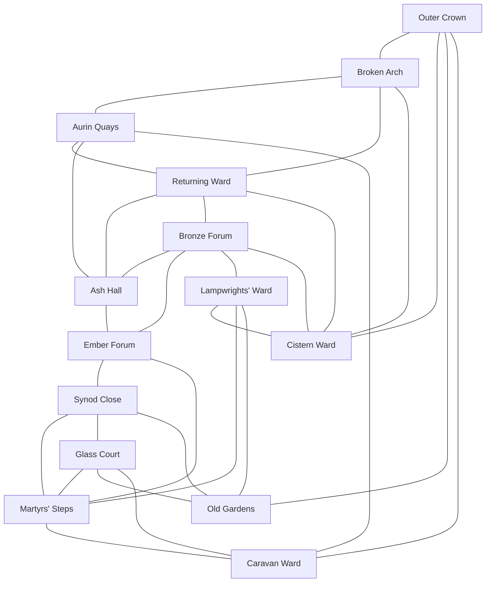

# Caleran Surface Map and Adjacency

## City Shape

Caleran occupies both banks of the lower Aurin before the river reaches the northwestern sea. The sacred and republican cores stand on raised ground east of the oldest river channel. Quays and warehouses follow both banks. Later walls enclose a broad crescent south and east, while the Outer Crown spills beyond the gates.

The city is not radial. Old walls, the river, aqueduct grades, collapsed forums, procession routes, and reused occupation defenses create bends, bottlenecks, and districts with more than one center.

## District Adjacency

| District | Direct neighbors | Principal routes |
|---|---|---|
| Ember Forum | Synod Close, Ash Hall, Bronze Forum, Martyrs' Steps | Sacred Way, Pillar Steps |
| Synod Close | Ember Forum, Glass Court, Martyrs' Steps, Old Gardens | Synodal Walk, Archive Gate |
| Ash Hall | Ember Forum, Bronze Forum, Returning Ward, Aurin Quays | Imperial Way, Ash Bridge |
| Bronze Forum | Ember Forum, Ash Hall, Lampwrights' Ward, Returning Ward, Cistern Ward | Civic Way, Bronze Bridge |
| Aurin Quays | Ash Hall, Returning Ward, Broken Arch, Caravan Ward | River Road, Salt Bridge |
| Lampwrights' Ward | Bronze Forum, Cistern Ward, Martyrs' Steps, Old Gardens | Kiln Street, Lamp Arcade |
| Returning Ward | Ash Hall, Bronze Forum, Aurin Quays, Broken Arch, Cistern Ward | Standard Road |
| Glass Court | Synod Close, Martyrs' Steps, Caravan Ward, Old Gardens | Glass Avenue, North Gate Road |
| Martyrs' Steps | Ember Forum, Synod Close, Glass Court, Lampwrights' Ward, Caravan Ward | Pilgrim Stair, Mercy Road |
| Old Gardens | Synod Close, Glass Court, Lampwrights' Ward, Outer Crown | Cypress Road |
| Cistern Ward | Bronze Forum, Lampwrights' Ward, Returning Ward, Broken Arch, Outer Crown | Aqueduct Street |
| Broken Arch | Aurin Quays, Returning Ward, Cistern Ward, Outer Crown | Quarry Road |
| Caravan Ward | Aurin Quays, Glass Court, Martyrs' Steps, Outer Crown | Nations Road, River Gate |
| Outer Crown | Old Gardens, Cistern Ward, Broken Arch, Caravan Ward | Ring Road and four outer gates |

## Chokepoints

- **Pillar Steps:** closes Ember Forum during major rites.
- **Ash Bridge:** fastest heavy route between the old core and western quays.
- **Bronze Bridge:** civic procession and market crossing.
- **Salt Bridge:** freight, dock labor, and contraband.
- **Archive Gate:** controlled approach between Synod Close and Glass Court.
- **Broken Arch Gate:** main route for quarry carts and illegal salvage.
- **River Gate:** arrival point for pilgrims and foreign caravans.

## Undercity Overlay

Surface adjacency does not predict underground adjacency. Water galleries cross beneath civic boundaries; martyr roads follow former execution routes; occupation courts connect to name vaults outside their modern districts; Star complexes align to old celestial geometry.

Every district dossier identifies at least one known access. Secret or unstable connections belong in [[Under-Caleran Overview and Access Overlay]].

## Map Deliverables

The final map should show district boundaries, walls, bridges, gates, elevation, public undercity entries, aqueduct lines, processional routes, garrison sites, hospitals, granaries, and ferry crossings. The undercity overlay should use access networks rather than false floor-by-floor levels.

## Navigation

- [[Caleran Districts Overview]]
- [[Under-Caleran Overview and Access Overlay]]
- [[Caleran Numbers and Constraints]]
- [[Caleran MOC]]
