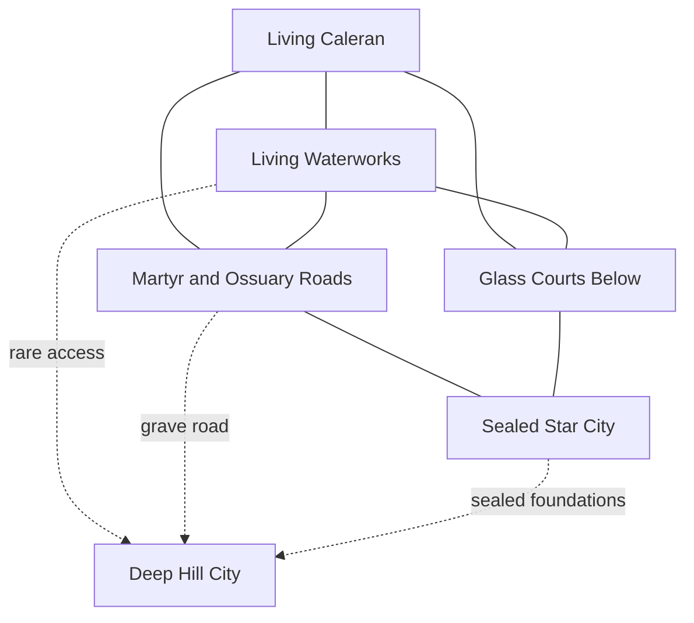

# Under-Caleran Overview and Access Overlay

Under-Caleran is not one dungeon and does not descend in historical order. Construction, collapse, water, quarrying, burial, occupation, and reuse have folded six archaeological strata through one another.

## Six Strata

1. pre-Atherian hill-city walls, cisterns, ancestor chambers, and shrines;
2. republican roads, drains, senate structures, and early Star works;
3. imperial temples, observatories, palaces, baths, and converted martyr crypts;
4. occupation courts, name vaults, garrison works, and bound infrastructure;
5. Reconquest siege tunnels, forts, icon caches, amnesty archives, and execution sites;
6. Qarath-era emergency works, faction crypts, sealed estates, and abandoned defenses.

## Five Playable Networks

- [[The Living Waterworks]]: active aqueduct, cistern, drainage, and mill systems.
- [[The Martyr and Ossuary Roads]]: burial, hospital, crypt, and soul-route infrastructure.
- [[The Sealed Star City]]: disconnected imperial complexes aligned by old celestial plans.
- [[The Glass Courts Below]]: occupation courts, customs chambers, and name custody.
- [[The Deep Hill City]]: oldest settlement layer, poorly understood and rarely reached.

## Public Access by District

| Surface district | Known access | Primary network |
|---|---|---|
| Ember Forum | supervised cathedral lifts | martyr roads |
| Synod Close | archive and seminary basements | Star city and converted schools |
| Ash Hall | palace service tunnels | Star city and imperial command works |
| Bronze Forum | vote tunnels and drains | republican works |
| Aurin Quays | culverts and flooded magazines | waterworks and occupation customs |
| Lampwrights' Ward | kiln drains and heat channels | baths and workshop undercrofts |
| Returning Ward | siege tunnels | Reconquest works |
| Glass Court | guarded court stairs | occupation courts and name vaults |
| Martyrs' Steps | hospital and ossuary lifts | martyr roads |
| Old Gardens | family crypts and villa tunnels | private imperial sites |
| Cistern Ward | supervised maintenance entries | waterworks |
| Broken Arch | cellar breaks | unstable mixed strata |
| Caravan Ward | merchant vaults | customs and courier works |
| Outer Crown | grave roads and siege mines | necropolis and Reconquest belt |

## Access Rules

Maps show networks, not complete rooms. An entrance can close through flood, collapse, legal seal, active contract, district construction, or occupation by people who live below. A route known to one faction is not assumed known to another.

The undercity contains work crews, shrines, storage, shelters, illegal homes, and infrastructure. Entering below does not mean leaving society.

## Navigation

- [[The Layers Beneath Thalmyria]]
- [[Caleran Surface Map and Adjacency]]
- [[Occult Investigation in Caleran]]
- [[Caleran MOC]]
