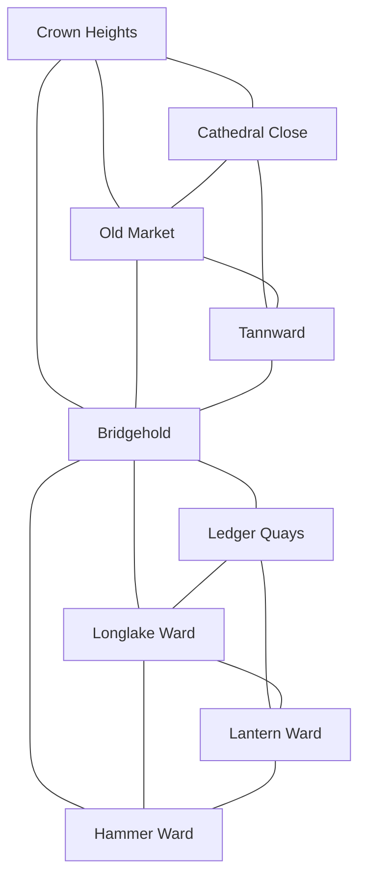

# Grenzburg City Adjacency and Access

## Surface Topology

| Zone | Direct surface neighbors | Principal routes |
|---|---|---|
| [[Crown Heights]] | Cathedral Close, Old Market, Bridgehold | Crown Road, Petition Stair |
| [[Cathedral Close]] | Crown Heights, Old Market, Tannward | Mercy Way, Chancery Lane |
| [[Old Market]] | Crown Heights, Cathedral Close, Tannward, Bridgehold | Market Spine, Guild Street |
| [[Tannward]] | Cathedral Close, Old Market, Bridgehold | South Road, Wallwright Lane |
| [[Bridgehold]] | Crown Heights, Old Market, Tannward, Ledger Quays, Longlake Ward, Hammer Ward | Great Bridge and lower pier stairs |
| [[Ledger Quays]] | Bridgehold, Longlake Ward, Lantern Ward | Quay Road, Ledger Street |
| [[Hammer Ward]] | Bridgehold, Longlake Ward, Lantern Ward | Mill Race, Forge Street |
| [[Longlake Ward]] | Bridgehold, Ledger Quays, Hammer Ward, Lantern Ward | Lake Road, Fish Street |
| [[Lantern Ward]] | Ledger Quays, Longlake Ward, Hammer Ward | Lantern Street, Debtors' Row |

## Gates and Exterior Roads

- **North Gate:** east-bank entry from the Grenz Lowlands and the Black Road.
- **Tann Gate:** east-bank southern road to Timberfalls, Tannbruck, and the military frontier.
- **Lake Gate:** west-bank road to Lakewatch and Longlake country.
- **Mill Gate:** west-bank service road to mills, charcoal tracks, Southwood trailheads, and outer camps.
- **River booms:** paired fortified towers control upstream and downstream boat passage.

Only [[Bridgehold]] carries wagons between banks. Small civilian ferries operate outside siege conditions but do not count as dependable military crossings.

## Layer Access

- [[Grenzburg Wall Circuit]] is reached through Tannward barracks, Crown Heights posterns, Lake Gate, and authorized tower stairs.
- [[Grenzburg Underways]] have known entries in every district, but surface neighbors do not predict underground adjacency.
- Roof routes are densest through Old Market, Lantern Ward, and Ledger Quays. Slayer movement and companion knowledge open shortcuts, never mandatory critical-path access.
- Riverworks connect Ledger Quays, Bridgehold, Hammer Ward mill races, and east-bank granary culverts.
- [[Outer Winter Camps]] attach principally to North Gate, Lake Gate, and Tann Gate.

## Access Rules

All surface streets open after Warrant at the Gate. Access checks apply to controlled interiors and tactical layers:

- ducal or military warrant for restricted keep, wall, store, and barracks spaces;
- Church standing, sanctuary, service, or covert entry for closed religious spaces;
- Bank or Blackjack standing for secure Ledger Quays and debtor records;
- local introductions or demonstrated conduct for Folk houses and refuge stores;
- discovery, keys, criminal standing, or physical entry for underways and rooftops.

No main quest requires one faction's access when a baseline public, investigative, or physical route can exist.

## Seasonal Route Changes

- **Autumn:** freight and refugee traffic create congestion rather than closures.
- **Winter:** bridge inspection, weapons control, district curfews, fires, crowd crush, and siege damage can redirect movement.
- **Spring:** floodwater closes low underways while wall breaches and clearance works open temporary routes.
- **Summer:** repaired bridges, rebuilt stairs, memorial closures, and faction patrols reflect world state.

## Navigation

- [[Grenzburg City Districts Overview]]
- [[Grenzburg City Anchor Register]]
- [[Grenzburg Travel and Road-Key Network]]
- [[Grenzburg MOC]]
