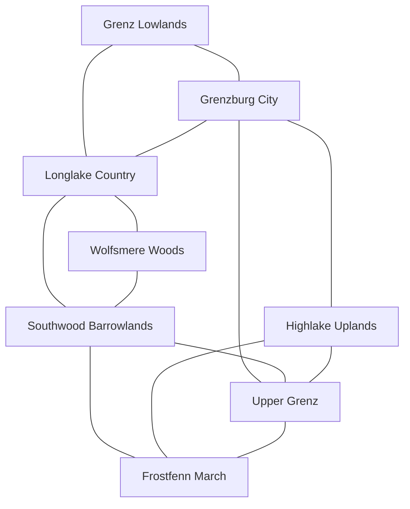

# Grenzburg Exterior Regions Overview

The playable frontier forms a southward fan around Grenzburg rather than seven isolated levels. Public roads and river routes bind its settled north. Forest paths, upland passes, military roads, and fixed Menhir crossings become increasingly important toward the cold south.

| ID | Region | Permanent population | Danger | Principal hub | Signature space |
|---|---|---:|---|---|---|
| GR-1 | [[Grenz Lowlands]] | 4,200 | low | [[The Funnel]] | [[Broken Tollworks]] |
| GR-2 | [[Longlake Country]] | 3,600 | low | [[Lakewatch]] | [[Sunken Causeway]] |
| GR-3 | [[Wolfsmere Woods]] | 1,500 dispersed | high | [[Moss-Crown Mootground]] | [[Bellless Hold]] |
| GR-4 | [[Southwood Barrowlands]] | 700 dispersed | high | [[Ashfield Lodge]] | [[Emerald Drake Range]] and the hidden [[Barrow of the First Chieftain]] |
| GR-5 | [[Highlake Uplands]] | 2,600 | high | [[Highlake]] | [[Cold-Iron Deeps]] |
| GR-6 | [[Upper Grenz]] | 4,000 | moderate | [[Timberfalls]] and [[Fort Tannbruck]] | [[Old River Arsenal]] and the evolving fort |
| GR-7 | [[Frostfenn March]] | 450 permanent | extreme | [[Fenn Road Exchange]] and [[Last Hearth]] | [[The Deep Muster]] |
| **Total** |  | **17,050** |  |  |  |

## Adjacency

The final Qianglong roads branch from Frostfenn toward the Fenn Road, Upper Grenz, and the Tuskway. They explain the Act III fronts without making Qianglong remains the cause of earlier regional problems.

## Exploration Contract

- All critical routes are traversable on foot by every vocation.
- Vocation, companion, and cultural knowledge reveal shortcuts, safer paths, hidden anchors, and optional rewards.
- Wolfsmere, Southwood, and Highlake each carry a full optional exploration identity rather than competing for one wilderness slot.
- Region danger is soft-banded. Main roads provide legible warning and retreat; high-danger pockets can exist in any region.
- Named sites remain changed when cleared. Only designated camps, nests, hunts, and job spaces can repopulate.

## Navigation

- [[Grenzburg Regional Geography]]
- [[Grenzburg Travel and Road-Key Network]]
- [[Grenzburg Seasonal Worldspace Matrix]]
- [[Grenzburg Worldspace Location Register]]
- [[Grenzburg MOC]]
