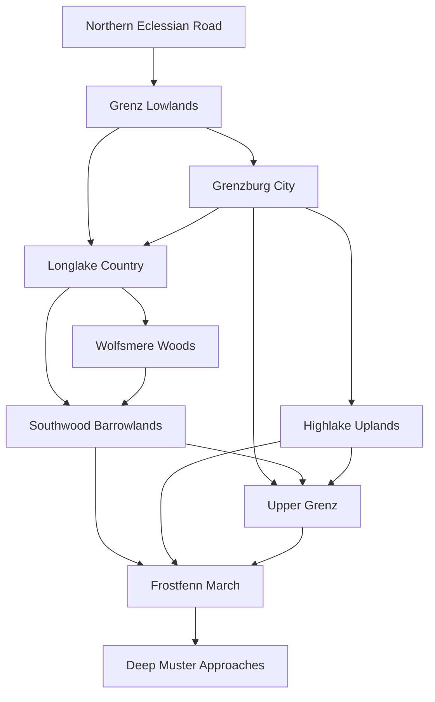

# Grenzburg Regional Geography

This is the sole authority for Grenzburg's base-game worldspace. It controls orientation, physical adjacency, regional ownership, main routes, public settlements, and the location of campaign-scale spaces. Subordinate dossiers may add local detail but cannot move a site or invent a disconnected route without updating this note and the production map.

## Orientation and Climate

The setting lies in the southern hemisphere. **South is colder.** Travel south from Grenzburg becomes more forested, less densely settled, and increasingly shaped by taiga, upland frost, permafrost, frozen wetland, and severe winter corridors. The River Grenz flows **north** from the Frostfenn and Upper Grenz toward warmer Eclessian roads.

Grobi pressure comes out of the deep southern belt as winter closes forage and routes. The Folk frontier is not a warm northern woodland transplanted onto the map; its forests, lakes, frozen soils, and seasonal movement belong to the cold south.

## Production Topology

Grenzburg is one contiguous worldspace. Its settled northern fan narrows into three southern military approaches:

No playable region is an isolated level. Public roads and water bind the north; paths, passes, military traces, and fixed Menhir links bind the colder south. [[Grenzburg City Adjacency and Access]] controls the city interior, while [[Grenzburg Exterior Regions Overview]] controls the regional fan.

## Grenzburg City

Grenzburg sits at the last dependable permanent bridge before the southern march. It is a **twin-walled river city**: two fortified halves joined by [[Bridgehold]], the only permanent crossing.

- The higher **east bank** contains [[Crown Heights]], [[Cathedral Close]], [[Old Market]], and [[Tannward]].
- The lower **west bank** contains [[Ledger Quays]], [[Hammer Ward]], [[Longlake Ward]], and [[Lantern Ward]].
- [[Grenzburg Wall Circuit]], [[Grenzburg Underways]], [[Outer Winter Camps]], rooftops, and riverworks form cross-district layers.

All eight surface districts open after *Warrant at the Gate*. Particular interiors, wall routes, roofs, and underways remain gated by discovery, standing, or quest state. The city holds about 18,000 permanent residents and approximately 32,500 people within the walls at winter peak.

## Seven Exterior Regions

| ID | Region | Hub | Identity | Signature space |
|---|---|---|---|---|
| GR-1 | [[Grenz Lowlands]] | [[The Funnel]] | farms, mills, convoy roads, and warmer northern approach | [[Broken Tollworks]] |
| GR-2 | [[Longlake Country]] | [[Lakewatch]] | fisheries, ferries, Chapel-Folk roads, and floodplain | [[Sunken Causeway]] |
| GR-3 | [[Wolfsmere Woods]] | [[Moss-Crown Mootground]] | deep forest, kindred law, sanctuary, and place-bound pressure | [[Bellless Hold]] |
| GR-4 | [[Southwood Barrowlands]] | [[Ashfield Lodge]] | hunters, barrow fields, war-magic scars, and Drake country | [[Emerald Drake Range]] |
| GR-5 | [[Highlake Uplands]] | [[Highlake]] | mines, cold tarns, Ghost-Foot crags, and Tuskway passes | [[Cold-Iron Deeps]] |
| GR-6 | [[Upper Grenz]] | [[Timberfalls]] and [[Fort Tannbruck]] | lumber, river industry, military road, and contested crossing | [[Old River Arsenal]] |
| GR-7 | [[Frostfenn March]] | [[Fenn Road Exchange]] and [[Last Hearth]] | taiga, frozen fen, migration routes, and ancient war roads | [[The Deep Muster]] |

The seven exterior regions hold about 17,050 permanent residents. [[Lakewatch]], [[Highlake]], and [[Timberfalls]] total 4,800. Fewer than 2,000 people live permanently south of Tannbruck.

### Grenz Lowlands

The Lowlands introduce the world through recognizable pressures: harvest, tolls, mills, convoys, banditry, and displaced people. The northern road and river converge at the Funnel before dividing around Grenzburg's walls. This is the prologue landscape and the safest early exploration band, not an empty tutorial corridor.

### Longlake Country

Longlake spreads west of the city and Lowlands. Lakewatch anchors public trade; ferries, marsh roads, fishing settlements, and Chapel-Folk refuge obligations make the region hospitable but seasonally fragile. Its western margin leads into Wolfsmere and its southern paths into Southwood.

### Wolfsmere Woods

Wolfsmere is a substantial optional exploration pillar, not a single faction grove. Its outer roads permit cautious traffic; deeper movement depends upon custom, witnesses, and readable place-law. The sacred inner boundary has no convenient waystone terminus. The region supports sanctuary disputes, hunting, local courts, old occupation ruins, and Menhir pressure without making every event supernatural.

### Southwood Barrowlands

Southwood lies between Longlake, Wolfsmere, Upper Grenz, and Frostfenn. Barrow fields, old growth, Ashfield's bounded war-magic scars, winter hunting paths, and the Emerald Drake's range give it a distinct search-and-pursuit identity.

The [[Barrow of the First Chieftain]] remains a hidden optional high-level site. Its Heart-Stone has no critical-path role and causes neither the siege, the Drake, Gerhold's choice, nor the Deep Muster.

### Highlake Uplands

Highlake is the eastern optional exploration pillar. Mines, cold tarns, cliffs, the Ghost-Foot heights, and the Tuskway combine vertical traversal with industrial and military stories. Ghor's organized coalition can use the broad eastern corridor, but the Uplands also contain ordinary miners, herders, hunters, ruins, and independent danger.

### Upper Grenz

The north-flowing river, Timberfalls industry, lumber camps, military road, Old River Arsenal, and Fort Tannbruck define the campaign's central supply corridor. Tannbruck's fall is fixed; evacuation, stores, intelligence, defenders, and later reclamation remain variable.

### Frostfenn March

Frostfenn is the far southern cold belt: taiga, frozen wetland, permafrost, sparse shelters, migration corridors, and the least forgiving early-entry pockets. The Fenn Road carries dependents, traders, raiders, and splinter bands; the Tuskway and Upper Grenz carry other military traffic. Uru's dependents and Ghor's war coalition do not use the land for the same purpose.

[[Deep Muster Approaches]] fixes the exterior basin at the far south. Ancient roads branch north toward the Fenn Road, Upper Grenz, and Tuskway. That topology makes the Act III dead march credible without making the Muster responsible for the Grobi siege, the Drake, Bank politics, or the region's ordinary hardships.

## Roads, Water, and Remote Crossings

[[Grenzburg Travel and Road-Key Network]] controls all public transport and lore-scale travel times. Public services follow physical roads or water and react to bridge state, siege control, weather, and settlement survival. There is no persistent player mount and no arbitrary map-click travel.

Seven fixed Menhir links serve remote destinations that ordinary carts and boats cannot sensibly reach. [[Road Keys and Menhir Paths]] controls their local custody, limited stock, and carrying limits. Every critical route remains walkable by all vocations.

## Campaign Movement

- **Prologue:** northern road to Grenzburg.
- **Act I:** city, near roads, settlements, Fort Tannbruck, and broad autumn exploration.
- **Act II:** dense city play plus deliberate winter expeditions to the Drake territory and Grobi siege positions.
- **Act III:** reopened roads, reclaimed holdings, Qianglong outer works, dead-march fronts, and the Deep Muster.
- **Summer:** return through changed settlements and routes with reconstruction visible.

Main-story travel should repeatedly cross known ground in changed conditions. New subregions open in layers, but old areas continue producing quests, services, consequences, and alternate routes.

## Military Corridors

The eastern Tuskway favors organized warbands and the movement of Ghor's main coalition. The western Fenn Road carries a greater share of dependents, opportunists, traders, and bands seeking survival corridors. Timberfalls and Tannbruck sit between those pressures and Grenzburg's core river road.

This split is strategic and moral geography, not a rule that everyone east is hostile and everyone west is innocent.

## Seasonal and Persistent States

[[Grenzburg Seasonal Worldspace Matrix]] controls autumn, winter, spring, and summer changes for the city and all seven regions. Every region visibly changes in traversal, inhabitants, hostile control, services, and damage or reconstruction.

Named dungeons and settlements retain their changed states. Wilderness nests, road camps, hunts, and designated job sites may repopulate only in the bounded ways recorded by [[Grenzburg Worldspace Location Register]].

## Base-Game Boundary

[[Birchcross]] and [[Alderway Vale]] remain valid wider-canon locations for independent adventures, but both lie outside the base-game worldspace and player atlas. Their starting situations and outcomes do not alter this map.

## Map Package

- ![[Grenzburg Regional Production Map.png]]
- ![[Ducal Survey of the Grenzburg March.png]]
- [[Grenzburg City Production Map]] and [[Grenzburg City Survey Map]]
- [[Grenzburg Transport and Waystone Overlay]]
- [[Grenzburg Seasonal Closures Overlay]]
- [[Grenzburg Dead March Overlay]]

The creator map controls exact production placement. The player survey shows only public terrain, roads, settlements, and major landmarks at the beginning of play. Minor paths, waystones, dungeons, and secrets are discovered in play.

## Navigation

- [[Grenzburg MOC]]
- [[Grenzburg Game Constitution]]
- [[Grenzburg Campaign Spine]]
- [[Grenzburg City Districts Overview]]
- [[Grenzburg Exterior Regions Overview]]
- [[Grenzburg Travel and Road-Key Network]]
- [[Grenzburg Seasonal Worldspace Matrix]]
- [[Grenzburg Worldspace Location Register]]
- [[Fort Tannbruck]]
- [[The Deep Muster]]
- [[Grenzburg Numbers and Constraints]]
- [[Gazetteer of the Known World]]
