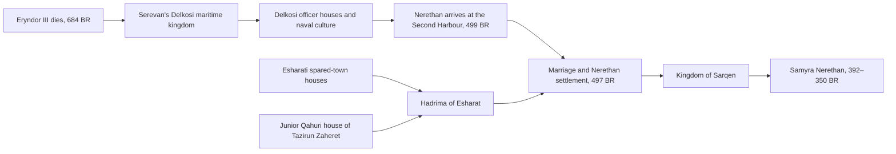

# After Alexander — Ptolemaic Egypt, Samyra and the Successor Inheritance

Cleopatra VII was a queen of Egypt and a member of a Macedonian Greek dynasty. Her ancestor Ptolemy had served as one of Alexander's generals and secured Egypt after Alexander's death. The dynasty governed an overwhelmingly Egyptian country from a heavily Greek royal city, used Greek as its principal administrative language, acted as pharaohs in Egyptian temples and depended upon Egyptian priesthoods, agriculture and labour. Cleopatra reportedly became the first ruler of her house to speak Egyptian. Calling her simply Greek or simply Egyptian therefore conceals the political substance of her position.

The World Egg already contains a strong equivalent, although its parts are deliberately distributed. **Qahur** carries the ancient river civilisation, native crowns, temples and foreign occupations associated with Egypt. **Qarzeth and the Gateway Republic** carry the Phoenician and Carthaginian history of western harbours, child sacrifice, overseas power and destruction. **Sarqen** grows from one of the spared towns rather than from the restored sacrificial capital. **House Nerethan** brings an Atherian military dynasty into that local kingdom. **Samyra Nerethan** inherits the resulting mixed court and becomes the Cleopatra-shaped ruler in the later imperial-founding drama.

Eryndor and his Successors strengthen these relationships. Serevan's kingdom gives Delkos and House Nerethan a Successor inheritance while Qahur retains its native political history and Samyra remains heir to a particular mixed dynasty rather than every northern throne.

## Cleopatra and the Ptolemaic settlement

Alexander took Egypt from Achaemenid rule in 332 BC. He was represented locally as pharaoh and founded Alexandria on the Mediterranean coast. After his death in 323, his officers divided commands while nominal kings survived briefly. Ptolemy secured Egypt, diverted Alexander's corpse into his own custody according to the dominant ancient tradition, and eventually assumed the title of king. His descendants ruled until Cleopatra's death in 30 BC.

The kingdom joined two political worlds. Alexandria contained the royal household, fleet, court, institutions of Greek learning and Hellenistic ruler cult. The countryside retained Egyptian towns, temples, languages, priestly houses and agricultural systems of much greater antiquity. Ptolemaic rulers funded traditional temples and appeared there in pharaonic form. The same rulers presented themselves in Greek royal form to Mediterranean audiences. Greek settlement and privilege altered social hierarchies without turning the Egyptian population into Greeks.

The dynasty's marriages and succession wars were often violent. Brothers and sisters ruled jointly, married within the house and killed rivals. Priesthoods, cities, soldiers and foreign powers intervened in royal disputes. Cleopatra inherited this political system. Her use of Egyptian language and ritual increased her reach within the country, while her court, dynasty and Mediterranean diplomacy remained Hellenistic. Her partnerships with Caesar and Antony served a royal programme concerned with survival, territory and the succession of her children.

The useful model is therefore **a foreign-origin dynasty becoming inseparable from the country it rules without becoming identical to every people within it**.

## Existing World Egg settlement

The current canon establishes the following sequence:

- Qahur is an Orphaned river civilisation of the Sacred Basin, with several Twin-Reed periods, local crowns and durable temple and irrigation institutions.
- Qarzeth leads a mixed Gateway Republic and conducts three major wars against Caleran. Its sacrificial establishment kills children despite internal resistance.
- Caleran destroys and salts Qarzeth around 525–520 BR. Lesser towns survive under varied settlements.
- Esharat is one of the surviving local communities. Hadrima of Esharat possesses a junior Qahuri maternal connection through Tazirun Zaheret.
- Nerethan of Delkos arrives as an Atherian harbour commander in 499 BR and marries Hadrima in 497 BR.
- Their house enlarges the Second Harbour into Sarqen and rules a population formed from spared-town communities, migrants, soldiers, merchants and neighbouring peoples.
- Samyra Nerethan, born in 392 BR, becomes queen of Sarqen and dies in 350 BR during the Atherian succession settlement.
- Her junior Qahuri ancestry enriches her ritual and diplomatic claims. It gives her no legal or sacred right to rule the whole Sacred Basin.

This history already resembles the Ptolemaic problem more closely than a direct copy would. Samyra belongs to an incoming dynasty and to the country which that dynasty has ruled for generations. Her state inherits local loss, local labour and local political memory. It also retains Atherian-speaking military and administrative traditions.

## Recommended Successor architecture

### The eastern maritime Successor kingdom

When Eryndor III dies in 684 BR, his fleet commander **Serevan of Delkos** gains control of Delkos, neighbouring islands and several eastern harbours. His forces include Atherian sailors, Arqeshite clerks, Vashari officers, discharged soldiers and local maritime households. He claims to protect the nominal heirs while building an independent kingdom.

Delkos becomes a Successor capital. Its rulers maintain an Atherian-speaking court, employ several administrative languages and adopt parts of Ubar and Qahuri royal ceremony. Their fleet moves grain, soldiers, diplomats and royal brides through the eastern inner sea. War with other Successors leaves the dynasty smaller than its founder's ambitions, but its officer houses and political culture survive after the principal kingdom fragments.

House Nerethan descends from one of these **later Delkosi officer houses**, rather than from Serevan or Eryndor himself. The interval between 684 and Nerethan's arrival in 499 spans approximately 185 years. During that time Serevan's royal house divides, loses territory and draws older naval households into the service of its successors. Nerethan's family preserves an inherited claim to command without requiring implausibly long lives.

Nerethan's established description as an Atherian harbour commander remains true. The addition explains what kind of Atherian military world formed him. He brings Delkosi drill, coin standards, household titles, naval patronage and a Successor memory of kingship into the Second Harbour.

### Hadrima and the local settlement

Hadrima is not a passive native bride who makes foreign conquest acceptable. Her Esharati household controls food, labour relationships, cult access and agreements among spared-town families. Her junior Qahuri ancestry connects her to one basin house without making her a displaced pharaoh.

The marriage of 497 BR joins two incomplete powers. Nerethan has soldiers, ships and Atherian recognition. Hadrima has local legitimacy, supply, kinship and knowledge of the surviving towns. Both gain authority. Families who lost children or kin at Qarzeth can still reject the new house, especially if Nerethan's followers occupy land assigned after the destruction.

The kingdom of Sarqen thus resembles Ptolemaic Egypt in court structure while retaining a different historical foundation. The dynasty arrives after the destruction of a Carthage-shaped republic and rules from a spared harbour. It does not conquer a unified Qahuri Egypt.

## How Eryndor affects Qahur

Eryndor enters divided Qahur around 695 BR. He needs river grain, boats, guides and a secure southern approach before the final campaign against Arqesh. Qahuri crowns choose separately. One grants a royal title and access to an oracle. Another bars storehouses and supports Arqesh. A third waits for the result before recognising either side.

His victory allows temporary Successor garrisons and marriages in selected crown lands after 684. Some officers present themselves as heirs of the conqueror's Qahuri title. Temple and irrigation houses continue to control the institutions without which no foreign court can collect grain or maintain canals. Over the following generations, local houses expel, absorb or domesticate the garrisons.

This produces a **Qahuri Hellenistic period** without imposing one continuous foreign dynasty over the whole basin. Atherian coin forms, military colonies and court art enter Qahur. Qahuri funerary craft, astronomy, temple architecture and royal language enter the Successor kingdoms. The exchange travels through artisans, wives, prisoners, priests and soldiers as well as royal policy.

Qahur remains the setting's ancient Egyptian civilisation. Its crowns are older than the conqueror and survive his political settlement. The Ptolemaic court grammar belongs principally to Delkos and later Sarqen.

## How the Successor age affects Samyra

Samyra can inherit four visible strands:

1. **Gateway country:** the spared towns, sea trade, remembered destruction of Qarzeth and disputes concerning child sacrifice and Caleran conquest.
2. **Esharati authority:** Hadrima's household alliances, local rites, agricultural property and the survival politics of the lesser towns.
3. **Junior Qahuri ancestry:** one maternal connection to a basin house, expressed through names, ritual education and diplomacy rather than a claim to universal river kingship.
4. **Delkosi Successor culture:** an Atherian-speaking royal and naval tradition descending from the eastern kingdoms formed after 684 BR.

This makes Samyra culturally Sarqeni and dynastically mixed. She can speak the court Atherian of House Nerethan, one or more Gateway languages and a Qahuri ritual or diplomatic language. Like Cleopatra, her linguistic range becomes a political ability: she can address groups whom earlier members of her dynasty required interpreters to reach.

Her public image can change by audience. At Sarqen she appears in local harbour and spared-town regalia. Before Qahuri embassies she uses the styles appropriate to her maternal house. In Atherian diplomacy she presents herself as a Hellenistic-style queen and descendant of Nerethan of Delkos. These are related political performances, not proof that she changes supernatural identity.

Her kingdom remains the successor of the lesser towns. Qarzeth stays destroyed. Royal building may reuse stone from the old capital, but Sarqen does not become Qarzeth reborn. Families descended from sacrificial opponents, former civic houses, subject towns and Caleran settlers continue to contest what the kingdom inherits.

## The corpse of the conqueror

Ptolemy's seizure of Alexander's corpse was a powerful claim to succession. The World Egg can translate this through a funeral struggle without allowing a body to contain the dead king's soul.

Eryndor dies at Arqesh. His officers prepare a royal funeral vehicle intended for Ortheia or a jointly selected imperial tomb. Serevan diverts it to Delkos. Possession of the corpse allows him to receive veterans, issue coinage with the dead king's image and build a mausoleum visited by rival Successors.

Three historical layers may then coexist:

- the corpse genuinely reaches Delkos and remains there for several generations;
- later rulers move, divide or lose the remains during a dynastic war;
- Sarqeni royal tradition eventually claims that Nerethan carried one authentic relic west, while several rival objects circulate.

The body never grants command, sainthood or the conqueror's personality. His human soul has entered the ordinary human road. The Crowned Countenance and other Idol Masks may feed upon imperial display surrounding the tomb. Copied portraits, royal office and legendary persona remain separate from both corpse and soul.

This episode is high-value because it gives Delkos a reason to become the most prestigious maritime Successor court. It also gives Samyra's enemies a later accusation: that House Nerethan has always lived by stealing the dead and inheriting other people's crowns.

## The Egyptian-parentage romance

Pseudo-Callisthenes makes Alexander the son of the last Egyptian pharaoh Nectanebo, who deceives Olympias through astrology, disguise and a fabricated divine visitation. The story absorbs the foreign conqueror into Egyptian royal succession. Its mechanism is sexual fraud and must remain visible if used.

The proposed canon retains this as a Qahuri and Successor controversy rather than authorial fact. A later Qahuri romance claims that Eryndor's mother was deceived by an exiled Qahuri magician-king and that Valeron raised another man's son. Successor courts use the story to legitimise Eryndor's Qahuri title. Ortheian traditions condemn it as slander against his mother. Qahuri opponents condemn the magician as a rapist who used ritual authority to obtain sex through deception.

The historical Eryndor remains the human son of Valeron II and his mortal queen. This preserves Valeron's political achievement, the household struggle after the assassination and the setting's continuity rules. The romance's existence still reveals how dynasties manufacture ancestry around conquest.

## Three translation routes

| Route | Arrangement | Strength | Cost | Disposition |
|---|---|---|---|---|
| **S1. Delkosi Successor inheritance** | Serevan's eastern maritime kingdom leaves officer houses; Nerethan descends from one and founds Sarqen with Hadrima | strengthens existing dates and gives Samyra a true Ptolemaic-style court without erasing local peoples | requires Delkos and its Successor history to be developed | **selected for Package B reconciliation** |
| **S2. Direct Successor dynasty over Qahur** | one general's descendants rule most of the Sacred Basin until the imperial-founding age | closest surface resemblance to Ptolemaic Egypt | crowds the Twin-Reed crowns, Vasharan intervention and Qahuri agency; gives Samyra the wrong homeland | **reject** |
| **S3. Romance and title only** | House Nerethan merely claims an Alexander-linked tradition with no historical Delkosi state | requires few changes | leaves the Successor age politically thin and turns Samyra's court into costume rather than inheritance | **insufficient alone** |

S1 preserves every useful difference. Qahur remains Egypt-shaped at the civilisational level. The Gateway remains Carthage-shaped in its republican and sacrificial history. Sarqen becomes a spared-town kingdom ruled by a dynasty carrying Atherian Successor culture. Samyra combines those inheritances without being reduced to a renamed Cleopatra.

## Proposed relationship chain

The diagram records dynastic and institutional inheritance. It does not imply uninterrupted biological purity, a right to Qahur or descent from Eryndor.

## Consequences for future canon work

The proposed joint Package B canon pass should add:

- the eastern maritime Successor kingdom centred on Delkos;
- Serevan's foundation and the diversion of Eryndor's royal funeral;
- a clear distinction between the founder's royal house and later Delkosi officer houses;
- temporary Successor garrisons and mixed court culture in selected Qahuri crowns;
- the disappearance or dispersal of the conqueror's remains as an unresolved historical problem;
- the Egyptian-parentage story as received Qahuri and Successor romance, explicitly disputed.

Existing canon would then receive limited additions:

- [[The House of Nerethan]] would identify Nerethan's Delkosi household as an inheritor of the eastern Successor military tradition.
- [[The Spared Towns and the Nerethan Settlement]] would explain what the arriving commander's titles, ships and household practices mean.
- [[Samyra Nerethan]] would clarify her court language, local languages, three political registers and relationship to the Successor inheritance.
- [[Ancient Qahur and the Twin-Reed Crowns]] would describe the conqueror's visit, divided crown responses and limited post-684 garrisons.
- [[Qahur and the Gateway before Atheria]] would preserve the separation between Sacred Basin ancestry and Sarqeni sovereignty.
- the chronology and Successor articles would place Delkos between the Wars of the Inheritance and the arrival of Nerethan.

No existing statement that Samyra lacks a general claim to Qahur should be removed.

## Source-fidelity and identity rulings

- Cleopatra's dynasty is treated as Macedonian Greek in origin and Egyptian in kingship, territory and historical entanglement. These descriptions concern different aspects of the same monarchy.
- Hadrima and the spared-town population remain political actors. Their lives do not decorate Nerethan's legitimacy.
- The destruction of Qarzeth, murdered children, enslavement and confiscated land remain present in Sarqen's inheritance.
- Successor marriage, court culture and artistic mixture do not merge human peoples or supernatural beings.
- Eryndor, the Delkosi kings, Hadrima, Nerethan and Samyra possess complete human souls.
- Royal cult, corpse, relic, title, office, copied image, Mask and legendary persona remain separate.
- No miracle or oracle grants Samyra a Qahuri throne or proves the conqueror's alleged Egyptian parentage.
- The proposed history establishes no new Idol succession and no post-1360 outcome.

## Principal sources

- The Metropolitan Museum of Art, [“Egypt in the Ptolemaic Period”](https://www.metmuseum.org/de/essays/egypt-in-the-ptolemaic-period), describes the Macedonian conquest, Ptolemaic dynasty, Greek Alexandria, Egyptian temples, bilingual country and regional variation in cultural mixture.
- The Metropolitan Museum of Art, [“Nile and Newcomers”](https://www.metmuseum.org/perspectives/egyptian-ptolemaic-art-installation?rss=1), explains how Macedonian Greek rulers acted as Egyptian pharaohs while maintaining a Hellenistic court.
- The Metropolitan Museum of Art, [“A Mediterranean Game of Thrones”](https://www.metmuseum.org/fr/perspectives/mediterranean-game-of-thrones), provides a concise account of the Successor struggle and Ptolemy's use of Egypt and Alexander's body.
- The British Museum, [“Timeline of Ancient Egypt”](https://www.britishmuseum.org/learn/schools/ages-7-11/ancient-egypt/timeline-ancient-egypt), summarises Greek government language, Ptolemaic rule and Cleopatra's position as the last independent ruler.
- Cambridge University Press, [“The Languages of Law”](https://www.cambridge.org/core/books/law-and-legal-practice-in-egypt-from-alexander-to-the-arab-conquest/languages-of-law/09D082E1A03C41C128E3A97114060DCC), distinguishes the Egyptian-speaking majority from Greek administrative and legal dominance.
- John J. Johnston, [“The Rattle of the Sistrum”](https://www.cambridge.org/core/books/abs/rome-season-two/rattle-of-the-sistrum-othering-cleopatra-and-egypt-in-rome/FA5ADE4AC42CA6EB4D97AF3B0E69A434), discusses Cleopatra as the first of her lineage reported to read and speak Egyptian and the dynasty's audience-dependent forms of representation.
- William L. Hanaway, [“Eskandar-Nama”](https://www.iranicaonline.org/articles/eskandar-nama/), supplies the Nectanebo genealogy, Persian royal genealogies and the transformation of Alexander into several cultures' king.

## Related World Egg articles

- [[The Alexander Romance - Sky, Sea, Speaking Trees and the Limits of Conquest]]
- [[The Upland Conqueror - Atherian Placement and Canon Impact Review]]
- [[The House of Nerethan]]
- [[Samyra Nerethan]]
- [[The Spared Towns and the Nerethan Settlement]]
- [[Qahur and the Gateway before Atheria]]
- [[Ancient Qahur and the Twin-Reed Crowns]]
- [[Historical Atlas of the Gateway Country]]
- [[Package B - Qiryath and Eastern Empires/Package B - Final Reconciliation and Canon Readiness Review|Package B — Final Reconciliation and Canon Readiness Review]]
