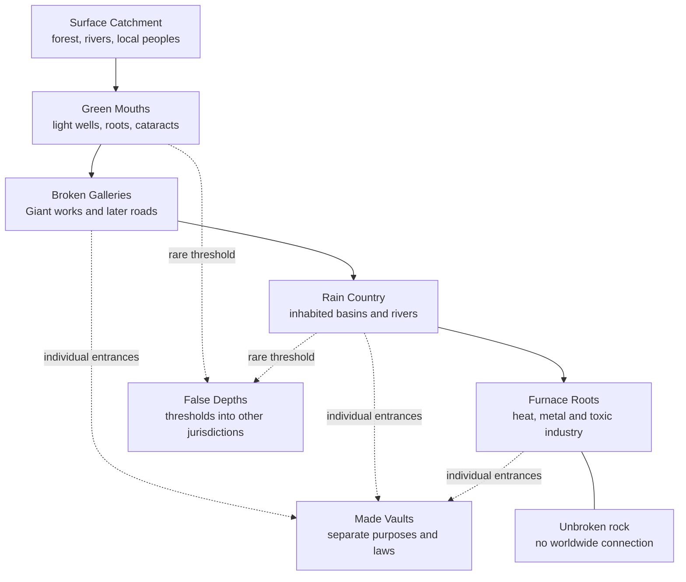

# The Country Beneath the Rains — First Subterranean Region Chassis

> [!warning] Provisional expansion region
> **The Country Beneath the Rains** is an authorial working name for the first full subterranean-region test. It does not create a canon continent, map site, culture, Giant polity, Menhir, Patron or present-day first contact. Its names, dimensions and actors remain provisional.

## Selection Ruling

The first true deep country belongs beneath an unmapped inland river-and-escarpment zone of the [[Gazetteer of the Known World|Emerald Expanse]]. It is not beneath Caleran, Grenzburg, the Great Glass Desert, the Last Houses or the Nsizwa continent.

| Candidate | Disposition | Reason |
|---|---|---|
| Under-Caleran | `defer` | already possesses five mature networks and six historical strata; a deep country here would duplicate a finished undercity and further crowd the imperial core |
| Veridun and Virelos mountain roots | `defer` | strong future refuge-and-mine region, but Thalmyria already holds the setting's densest history and infrastructure |
| Great Glass rim | `defer` | excellent for a hostile expedition but too likely to explain or domesticate the protected Weird of the Glass |
| Folk–Grobi deep south | `defer` | strong Menhir and cold-cavern grammar, but it would collide early with the Deep Muster, the General Below and Grenzburg's present campaign architecture |
| Nsizwa continent | `defer` | requires a dedicated Nsizwa geography and Izivukwa audit before adding an unrelated deep civilization |
| Last Houses homeland | `reject for this pass` | their no-contact ruling forbids using an underground route as a disguised shortcut into the present setting |
| Emerald Expanse inland | `retain` | widens the world, supports Orphaned humanity and Giant archaeology, provides a Castaran expedition aperture and allows severe technological inequality without rewriting the imperial core |

## Regional Thesis

The Country Beneath the Rains is a **Material subterranean watershed**. Surface rivers vanish through a forested limestone and volcanic escarpment, cross several miles of broken galleries and feed a chain of enormous inhabited basins. Most space remains rock. The region is an archipelago of chambers joined by difficult water, shafts and inherited works, not a hollow continent.

Its oldest human populations descend principally from captives, maintenance workers, miners, burial crews, soldiers, displaced households and subject communities which survived the Giant collapse outside the Prophet's host. They are **Orphaned humanity**, not a lost Ark tribe. They possess complete Image-bearing human souls.

The deep country is neither primitive nor uniformly advanced. One city may operate a Giant pressure gate while unable to manufacture steel nails. A river town may preserve surgery and lose writing. A furnace monarchy may cast excellent iron by spending enslaved workers faster than it can replace them. Surface communities may possess poorer masonry and much better medicine, navigation and knowledge of the living forest.

In 1360 AR, local Expanse peoples know that inhabited depths exist, although their relationships with them differ by region and generation. Castara possesses rumours, traded objects, forged maps and several alarming material samples, but no verified map, embassy or direct report from a subterranean state. Any first Castaran contact remains a future campaign decision under the Forward Rule.

# I. Physical Chassis

## Regional Extent

The test geography occupies a surface catchment roughly two hundred miles across. Its subterranean chambers and passages extend irregularly beneath perhaps ninety miles of that catchment. No single open cavern spans that distance.

The largest inhabited chambers are provisionally between two and nine miles across, divided by pillars, ridges, collapsed blocks and artificial walls. Ceiling heights range from a few yards in roads and drains to more than a mile in exceptional collapse basins. Giant buttresses stabilise portions of the largest chambers; their failure has already destroyed other districts.

The deepest routinely inhabited works lie roughly two miles below the highest plateau. “Deeper” routes which reach a supernatural jurisdiction cannot be converted into ordinary vertical measurements.

## Cross-Section

| Band | Physical character | Regular inhabitants | Principal resource | Principal danger |
|---|---|---|---|---|
| **Surface Catchment** | tropical forest, volcanic ridges, sink rivers, floodplains and worked ruins | several unassigned surface peoples, expedition camps and ordinary wildlife | sunlight, wood, crops, river fish and access | flood, disease, warfare, predation and Castaran extraction |
| **Green Mouths** | sinkholes, root galleries, bat chambers, seasonal light wells and cataract stairs | mixed surface–deep households, hunters, smugglers and watch settlements | wood fall, guano, insects, light crops and clean air | flash flood, falling timber, raiding and closure from above |
| **Broken Galleries** | Giant freight cuts, cisterns, mines, burial ways, collapsed estates and later human roads | road towns, salvage camps, refugees, engine custodians and predators | worked stone, stored metal, old tools and route control | bad air, obsolete engines, slave raids, collapse and false maps |
| **Rain Country** | a chain of large watershed basins with rivers, lakes, stone forests and inhabited terraces | most deep human cities and boat communities | water, fish, fungus, insects, cultivated roots and transport | flood war, water seizure, crop disease and control of ventilation |
| **Furnace Roots** | hot faults, sulphur water, mineral seams, toxic vents and foundry caverns | miners, furnace castes, prisoners, specialist households and sparse fauna | iron, copper, salt, sulphur, heat and chemosynthetic mats | poisoning, burns, gas, forced labour and structural failure |
| **Made Vaults** | individually sealed Giant or later environments attached to several bands | each vault differs; no shared native population | preserved seed, machinery, archives, weapons or claimed ancestors | failing maintenance, false identity, enclosure law and trapped populations |
| **False Depths** | particular thresholds mistaken for still-lower caves | proxies, court-law beings, Masks, fauna or stranded travellers according to site | routes, bargains, forbidden evidence or supernatural leverage | category error: travellers prepare for rock and enter another jurisdiction |

These bands overlap. A Made Vault may open in the Broken Galleries, and a False Depth may begin behind an ordinary Rain Country shrine. They are not seven uniform planetary shells.

## Four Access Types

1. **Cataract mouths:** rivers fall through great sink systems. They carry food and boats but become impassable during the rains.
2. **Breathing chimneys:** narrow shafts drive air through temperature and pressure differences. Most cannot carry a human body without climbing or excavation.
3. **Giant freight inclines:** artificial ramps and lift wells built for heavy cargo. Most are broken, buried or controlled by a surface community.
4. **Drowned mouths:** passages accessible only during low water or from submerged river chambers.

No known access connects to another continent. The Last Houses cannot be reached through this system.

# II. Air, Water, Food and Light

## Air

The inhabited country survives through two linked natural systems:

- falling water drags fresh air through the upper mouths;
- geothermal heat lifts foul air through distant chimneys.

Giant and later human walls redirect this circulation. An open gate can ventilate three settlements; a collapsed stair can suffocate a mine. Smoke, corpse disposal, foundries and military fire therefore create political consequences far beyond one room.

Major cities maintain **breath registers** recording shafts, seasonal flow, permitted furnaces and emergency refuges. These began as survival records. Several governments use them to deny air to rebels, slaves and unwanted districts.

## Water

Surface rain is the system's largest material input. It arrives with wood, soil, seeds, carcasses, fish, insects and contamination. Deep rivers join, divide and disappear into lower stone. No government has traced every outlet.

Water produces four recurring political facts:

1. an upstream surface settlement can poison a deep city without knowing it;
2. a deep dam can flood or drain a surface sacred place;
3. river pilots possess route knowledge armies cannot replace quickly;
4. opening one old Giant gate may save a district and drown another.

The ceremonial phrase **the many rains** does not establish a fixed number of rivers. Later religions may insist upon seven, nine, twelve or one.

## Food

The region has no generic self-sustaining mushroom abundance. Its food web uses several separate inputs.

### Green-Mouth production

Where true sunlight reaches sinkholes, communities terrace soil for tubers, gourds, grain analogues, herbs and fruiting vines. Surface timber, leaves and flood debris enter here. These sites are the richest and most fought over.

### Detritus agriculture

Fungi and insects break down wood, guano, plant waste and animal matter carried from above. People cultivate selected fungal beds, cave crickets, beetle larvae and edible worms. The fungi recycle imported energy; they do not create it.

### River production

Blind and low-light fish, eels, crustaceans and molluscs support boat communities. Seasonal spawning runs can feed cities or fail catastrophically after a gate change.

### Furnace production

Sulphur- and methane-using microbial mats support a small, chemically harsh lower food chain. People harvest mat, worm and shellfish products using masks and neutralising washes. This is dangerous famine food and specialist industry, not a pleasant universal cuisine.

### Stored and traded food

Salt, smoked fish, insect meal, dried fungus and root flour move along the rivers. A city unable to import surface-grown carbohydrates becomes smaller, more coercive or both.

## Light

Deep communities use mirrors at light wells, oil from fish and insects, low-smoke wick lamps, selected luminous fungi, furnace glow and a few surviving Giant fixtures. Luminous organisms supply illumination, not free agricultural energy.

Public light is a form of government. Extinguishing a quay or stair exposes residents to falls, predators and robbery. Wealthy streets burn longer because they can purchase fuel and cleaner air.

## Carrying Capacity

The first test should assume roughly **90,000–160,000 humans** across the whole deep country, subject to later mapping. No city should exceed approximately 25,000 without a separately demonstrated food and air system. Large ruins may have held far more under Giant extraction and imported captive labour; their abandonment is evidence that the old scale was unsustainable after collapse.

# III. Peoples and Political Ecologies

The following are provisional political families, not fantasy ancestries or final cultures.

## 1. The Falling-Water Cities

Several independent human cities occupy light wells and major cataracts. Their founders were mixed maintenance and refugee populations. Each city claims to be the first community that made the deep country habitable after the Giants, although excavation shows older inhabited layers beneath all of them.

- **Government:** assemblies, hereditary water houses, temple officers, military gate captains or combinations which vary by city.
- **Economy:** terraces, fish, guano, rope, pottery, river tolls and control of surface exchange.
- **Strength:** reliable food, clean air, literacy in practical water records and access to the surface.
- **Hard edge:** cities have drowned rival farms, sealed refugee shafts, enslaved defeated river families and executed people who opened emergency gates without permission.
- **Internal conflict:** public water law versus hereditary control of the mechanisms which make that law real.

Nothing requires the cities to share one language, religion or confederation.

## 2. The Lower-Current Houses

Boat households, ferrymen, fishers, pilots and mobile market companies inhabit the long interior rivers. Kinship, adoption, apprenticeship and vessel ownership matter more than territory.

- **Government:** boat councils and route compacts which assemble at seasonal markets.
- **Economy:** transport, fishing, salvage, messages, hostage exchange and smuggling.
- **Strength:** the only widely distributed practical route knowledge.
- **Hard edge:** some Houses carry escaped slaves; others sell them. Several demand children as debt-hostages, abandon passengers during famine and conceal drownings to preserve a route's reputation.
- **Internal conflict:** whether route knowledge is a common survival trust or inheritable private property.

They are not Jirahar, do not possess Prophet's Roads and have no Way-Gates.

## 3. The Ash-Well Crown

One industrial monarchy controls the safest descent into a geothermal and mineral complex. Its ruling genealogy claims descent from the Giant engineers who “gave fire to the abandoned.” The ruling people are authorially human, perhaps including giant-blooded humans; every human birth still bears a complete human soul.

- **Government:** crown, furnace priesthood, military mine offices and hereditary work classifications.
- **Economy:** iron, copper, salt, sulphur, durable tools and repairs to selected ancient mechanisms.
- **Strength:** the best metallurgy in the region and the only workshops able to replace several vital pressure parts.
- **Hard edge:** debt becomes hereditary work assignment; prisoners and conquered households absorb lethal gas and heat exposure; children selected for furnace training are permanently injured; failed strikes end through shaft closure and deliberate suffocation.
- **Cultural contradiction:** its tools save thousands of lives throughout the deep country, while its production system treats particular humans as consumable parts.

The Crown's claimed Giant ancestor is not accepted as historical fact. A copied engineer, office-pattern, dependent Idol Mask or fabricated genealogy could answer in its vault.

## 4. The Shut Refuge

A Made Vault contains a human population descended from people admitted during the Great Unbinding and its aftermath. The vault still possesses controlled air, stored seed lines and a repeating maintenance calendar. Its gates open rarely and only under inherited conditions.

- **Government:** maintenance offices presented as sacred descent.
- **Economy:** intensive enclosed agriculture, exact rationing and repair.
- **Strength:** preserved seed, medicine and records unavailable elsewhere.
- **Hard edge:** the founders selected who entered, killed people forcing the gate and converted emergency ration categories into hereditary status. Later rulers expelled “surplus” children and political offenders into unventilated service corridors.
- **Cultural contradiction:** the system genuinely preserved a community and then made the emergency permanent.

The Shut Refuge is not the Glass Ark, Yima's Vara, Mystara's Hollow World or the Last Houses. No Prophet founded it and no divine commission guarantees its law.

## 5. Mouth Households

Families living between surface forest and upper cavern carry language, spouses, medicine, stories and contraband in both directions. Some descend from deep exiles; others from surface people who adopted sinkhole work.

- **Government:** local guest-law, marriage alliances and control of particular descent equipment.
- **Economy:** timber, medicine, salt, metal, guides and information.
- **Strength:** knowledge which prevents either side treating the other as an unknown species.
- **Hard edge:** both surface and deep rulers accuse them of divided loyalty; punitive expeditions burn homes, seize mixed children and force guides to lead armies against relatives.
- **Present role:** the most likely witnesses to recognise Castaran fraud or prevent a first expedition from becoming an invasion.

They are not automatically one people and should receive names only during the surface-culture pass.

## 6. Nonhuman and Legacy Presences

| Presence | Possible continuity | Present ruling |
|---|---|---|
| Giant wall-wardens and maintenance speakers | `constructed-pattern` or `infrastructure-office` | behaviour is not personhood; identify a bearer if an office is involved |
| a claimed surviving Giant engineer | `giant-continuity`, copy, office, residue, Mask, Patron proxy or fraud | remains deliberately unclassified; no public miracle settles the issue |
| autonomous residue-born minds | `residue` | new beings, never the returned souls of the workers whose memories they use |
| deep animals and altered lineages | `biological-pattern` | require separate ecology and reproductive history |
| local water and stone presences | `court-law` | local Menhir expressions or place minds, not human souls or elemental peoples |
| Idol manifestations | `idol-pattern` under an existing `yolk-sovereignty` | humans supply feeding architecture but did not create the Idol |
| Egg White speakers at one vault | `astral-pattern`, proxy or another separately stated continuity | being a Patron describes an anchor relation, not a species |

No pure `constructed-pattern` or `shell-pattern` becomes a person through age, complexity or pleading.

# IV. Historical Spine

## 1. Before Giant Occupation

The watershed, caves and much of the biological system predate Giant use. Geological evidence must remain capable of disproving later Giant inscriptions claiming that a king made the rivers and hollowed the world.

Human presence before the principal Giant works remains open. Do not use this region to identify the Pale-Skins, Hollow-Kings or another protected prehuman layer.

## 2. Client-Estate Centuries

A lesser Giant palace league or client crown occupies the surface catchment and deep mineral system during the Age of Chains. It is not a sixth Imperial Horizon and not automatically one of the five capitals. Its later horizon affiliation remains open.

The court enlarges freight roads, stabilises chambers, redirects rivers and builds several Made Vaults. It imports enslaved miners, hydraulic workers, physicians, burial crews, soldiers and food-producing households from more than one subject population. Giant histories describe them collectively as tools belonging to the estate.

The deepest mines produce wealth and continuity materials. Workers die through gas, collapse, mutilation and punishment. Bodies judged useful to reclamation systems are processed; others are denied burial to prevent organised ancestral memory.

## 3. Closing-Court Conversion

As Giant systems fracture, the regional dynasty tries to convert the deep complex from an extraction estate into a refuge and continuity holding. Food stores, air, seed, copied ancestors and loyal populations are assigned places according to rank. Dependent districts are ordered to deliver supplies without receiving berths.

Several Giant houses fight over the limited refuge. Human maintenance workers learn that following every command will overload air and water before the court finishes sealing itself.

## 4. The Closing of the Great Incline

During the Great Unbinding, enslaved workers, defecting soldiers and subject households seize the principal freight incline. A Giant-aligned force pursues refugees toward the inhabited chambers.

A human maintenance council orders the incline collapsed and one ventilation gallery sealed. The decision prevents the pursuers reaching the largest refuge basins. It also kills captives, wounded people, servants and families still climbing behind them. Some were deliberately denied entry because officials judged their work, illness or allegiance undesirable.

This is neither an immaculate liberation nor proof that the closure was unnecessary. The deep country survives because the gate closes; particular rulers also exploit the emergency to murder inconvenient people. Later traditions divide into heroic closure, unforgivable massacre and Giant betrayal accounts.

## 5. First Deep Famine and Reassembly

The survivors inherit machines built for imported food and a larger ventilation system. Stores fail. Communities fight over light wells, fish runs and seed. Ration officers expose prisoners and the sick first. Several cities are abandoned after air and water collapse.

Maintenance fraternities, burial registers, boat houses and terrace communities gradually establish new law. The first durable compact forbids any one city from sealing all downstream water. It does not abolish slavery, hereditary work or gate war.

## 6. The Air-King Centuries

One sequence of rulers gains control of several breathing chimneys and demands hostages, labour and worship from lower cities. Later liturgies treat the Air-King as one immortal founder. Material evidence instead suggests several human rulers wearing the same pressure office, while an Idol Mask gradually adopts their composite public face.

Rebellions destroy part of the air network. Victory frees some cities and suffocates districts whose inhabitants had depended on the same system. No heroic version can erase those deaths.

## 7. Surface Return and Divergence

Some communities reopen upper mouths and encounter human societies which survived separately on the surface. Trade, intermarriage, raid, captive-taking and religious argument follow. Neither side discovers an empty world or one lost branch of itself.

The deep imports medicine, timber and crops. Surface rulers seek metal, preserved machines and military routes. Several centuries of contact end when warfare, disease and deliberate shaft destruction close the easiest approaches. Other mouths remain locally known.

## 8. The Present Deep Country

By 1360 AR the deep world contains several cities, declining works, ruined states and isolated vaults. No polity rules the whole watershed. Their histories preserve the Giant collapse in mutually incompatible forms.

Castaran expeditions on the distant coast have begun buying alleged deep metal, route tablets and ancestor objects. Most are surface finds, local trade goods, plunder or forgery. A few pressure parts and blind river animals establish that a major subterranean ecology probably exists. They do not reveal its extent or people.

# V. Greater-Power Ecology

## Menhir and local court-law

Water-Wives, Stone-Voices, root presences and other local place minds can arise through existing Menhir sovereignty. They respond to flow, enclosure, weight, burial and seasonal passage. Their bargains can sustain a channel or punish someone taking the last water while hiding downstream need.

They do not judge slavery, approve a dynasty or create the human soul. A cruel city can obey a water law perfectly and remain cruel.

No new Menhir is named in this pass. Promotion requires establishing whether the regional laws belong to an existing sovereignty, a conjunction or minor place minds under several courts.

## The Breath-Crown Mask

The **Breath Crown** is a provisional dependent Idol-Mask hypothesis, not a new Idol or confirmed Archmask. It may have formed around the Air-Kings' equation of rank with permission to breathe.

Its feeding architecture includes:

- public praise of rulers who “give” air they merely control;
- hereditary shame attached to smoky or low districts;
- ritual suffocation presented as proof of impurity;
- the conversion of emergency ventilation into tribute;
- fear that sharing air will make everyone choke.

Destroying a visible Air-King, engine or cult does not destroy an Idol Throne. Proving the Mask existed does not prove every Air-King was its Regnant or bearer.

## The Listener Behind the Dry Vault

One Made Vault may possess an Egg White correspondence. A speaker offers accurate pressure forecasts and lost maintenance instructions in exchange for copied route memories, household testimony and the right to place a proxy at repairs.

The speaker could be an anchor-owning Giant continuant, copied engineer, archive-pattern, Patron claimant or intermediary. Nothing in this pass decides. Its information can be useful while its identity claim remains false.

## Infernal and Abyssal limits

No ordinary descent reaches Hell. A chthonic breach could open where water and earth meet leftward pressure, but it would be a local thin space governed by [[Hell, Depth, and the Abyss]], not the natural bottom of the region.

No Abyssal wound is planted in the first pass. The region does not require a secret General Below, Blood War front or sleeping true dragon to matter.

## Saints and sacred intervention

No pre-contact local figure is declared an Orthodox saint through this dossier, and no saint governs a deep city. If Redeemer teaching reaches the region later, genuine sanctity, martyrdom, counterfeit relics, destructive mission politics and bounded saintly intercession must be worked through that historical contact rather than projected backward automatically.

# VI. Technology and Material Culture

## Ordinary capabilities

- river craft, rope, climbing frames and counterweight lifts;
- pottery, stonework, bone, copper, bronze and regionally available iron;
- fungus, insect, fish and root agriculture;
- wound care, smoke treatment and practical gas testing;
- water clocks, flood calendars and acoustic signalling;
- strong oral route traditions alongside several unrelated writing systems.

## Uneven inherited capabilities

- pressure doors whose makers cannot be replicated;
- Giant pumps repaired through inherited sequence rather than theory;
- mirrors or light conduits requiring rare surface materials;
- vault seed lines protected by offices whose theology is false;
- copied maintenance speakers able to diagnose one system and nothing else;
- high-quality furnace output purchased through lethal labour rather than general scientific mastery.

## Absent conveniences

- no universal deep language;
- no continent-wide postal or trade system;
- no easy teleportation;
- no unlimited food from luminous fungus;
- no perfect map inherited from the Giants;
- no mechanism able to recall or preserve human souls;
- no reliable ability to manufacture every part of an ancient system.

# VII. Evidence and Discoverability

## What Castara thinks

Castaran claims fall into four groups:

1. **commercial certainty:** promotional maps showing a rich empty interior;
2. **scholarly inference:** blind animals, pressure parts, mineral samples and river chemistry;
3. **local testimony:** translated warnings and trade accounts damaged by coercion and bad interpretation;
4. **fraud:** guides inventing one hidden empire, perfect king or universal tunnel system.

No single Castaran source proves an inhabited deep country.

## What local surface peoples know

Knowledge varies. One polity may trade at a Green Mouth, another seal every sinkhole, and another remember only that raiders once emerged from below. “The local people knew” is too broad to serve as evidence.

## What deep peoples know

Deep archives preserve working routes and local wars better than surface chronology. They frequently mistake offices, copies and recurring Masks for immortal ancestors. No deep institution possesses a complete account of the Great Unbinding or the outside world.

## Six recoverable core truths

| Core truth | Evidence needed | What remains open |
|---|---|---|
| the main cavern system is natural rather than Giant-made | geology plus Giant construction seams | earliest human use |
| the Great Incline was deliberately closed by humans | tool marks, order fragments and bodies on both sides | whether the final order was necessary at that moment |
| excluded refugees were selected by status and usefulness | berth tallies plus household remains | every individual official's motive |
| the immortal Air-King was several rulers and an office | stratified burials, incompatible biographies and pressure succession records | exact number and which ruler first intersected the Mask |
| the Shut Refuge preserves copies and offices rather than resident ancestral souls | error transmission, body history and soul-route tests | whether one genuine manifestation ever occurred |
| Castaran “one kingdom below” maps derive from one guide family | repeated map errors, payment records and mutually exclusive itineraries | whether the guide encountered one real entrance |

Each core conclusion requires at least two independent evidence classes.

# VIII. Twelve Light Nursery Apertures

These are regional tests, not promoted Garden seeds.

## CBR-01 — The River That Returns Tools

A surface river carries worked tools upstream after heavy rain because an old pressure gate reverses one underground branch. Castaran prospectors call it proof of a metal city; a surface community knows the reversal precedes destructive flooding.

**Hard edge:** the last expedition opens the gate anyway, drowning a downstream settlement to recover a cargo chamber. **Use:** introduce the deep through material evidence before meeting its people.

## CBR-02 — The Last Breath Register

A Green-Mouth town inherits the only current map of three ventilation shafts. Its council removes outlaw districts from the copy distributed during fires.

**Hard edge:** families suffocate because officials intentionally classify them as non-residents. **Use:** make an apparently bureaucratic map into a direct instrument of killing.

## CBR-03 — The City Fed by One Root

One enormous surface tree feeds an upper cavern garden through root fall, water and animal traffic. Surface farmers cut it to clear land without knowing the deep settlement exists.

**Hard edge:** the resulting famine leads the deep city to raid upward and seize people as labour and hostages. **Use:** a conflict in which ignorance explains the first injury but not the retaliation.

## CBR-04 — The Ferry of Borrowed Children

A Lower-Current House takes children as security for transporting famine refugees. It has returned many safely and sold others when payment failed.

**Hard edge:** rescue requires confronting families whose survival depended on the same ferry system. **Use:** an institution which is both lifeline and trafficker.

## CBR-05 — The Gate Closed from Both Sides

Excavators find bodies outside and inside the Great Incline closure. The heroic account says only Giant soldiers stood outside; the tyrant account says no pursuers existed.

**Hard edge:** refugees, captives and pursuers were all present, and the human council selected whom it would abandon. **Use:** recover a necessary defence and a real atrocity without making them cancel each other.

## CBR-06 — The Furnace Children

Ash-Well officials select children with good heat tolerance for honoured training. Medical evidence shows repeated exposure produces the signs the priesthood claims to recognise at birth.

**Hard edge:** children are burned, blinded and killed to maintain an industrial caste myth. **Use:** expose a useful state industry whose sacred genealogy is manufactured through abuse.

## CBR-07 — The Strike Beneath the Closed Chimney

Furnace workers refuse a lethal production quota. The Crown seals their district's exhaust route and blames a natural gas event.

**Hard edge:** workers and dependants die together; outside cities hesitate to intervene because they require the replacement parts being produced. **Use:** attach distant consumers to the crime materially rather than through secret conspiracy.

## CBR-08 — The King Who Answers in Repair Instructions

A chamber speaker claiming to be the first Giant founder answers every religious question with accurate pump and gate procedures. Its childhood memories repeat errors from one copied manual.

**Hard edge:** rulers execute sceptics because the useful instructions sustain their legitimacy. **Use:** distinguish correct technical information from false personal identity.

## CBR-09 — The Market under Falling Water

A neutral market occupies the only dry crossing during flood season. Its peace law protects merchants but permits the sale of captives if their origin city has classified them as debt property.

**Hard edge:** neutrality keeps food moving and makes organised trafficking respectable. **Use:** build a morally culpable institution which cannot be dismissed as simple chaos.

## CBR-10 — The Vault That Preserves the Wrong Seed

The Shut Refuge opens a seed chamber during crop failure. Its labels were deliberately changed in an ancient purge, and the apparently sacred grain is poisonous without a missing preparation.

**Hard edge:** officials test it on prisoners and poor households before admitting the archive may be wrong. **Use:** preservation protects both life and inherited falsehood.

## CBR-11 — The Guide to the Single Kingdom

A charismatic surface guide sells Castarans a complete history of one perfect subterranean monarchy and claims exclusive access to its king. Every expedition travels a different route; people who threaten the story disappear.

**Hard edge:** fraud, robbery, abandonment and murder are more likely than a supernatural curse. One stolen tool may nevertheless come from a real deep market. **Use:** translate the Akakor grammar without inventing an Indigenous people or making the entire lie true.

## CBR-12 — The First Embassy That Has Not Happened

A Mouth household considers carrying a deep city's sealed grievance to a Castaran ship after an extraction camp contaminates its river. Other families fear that proving the country's existence will bring armies and slavers.

**Hard edge:** the pollution has already killed children and fishers; silence also allows the camp to continue. **Use:** a Forward-Rule first-contact aperture with no predetermined messenger, decision or outcome.

# IX. Source-Fidelity and Separation Register

| Source grammar | Regional use | Hard edge retained | Separation ruling |
|---|---|---|---|
| Forgotten Realms | several deep civilizations and exchange zones | slavery, sacrifice, predation and state violence | no drow, faerzress, Darklake or biological alignment package |
| Eberron Khyber | individual False Depths possess separate owners and laws | flesh alteration, interested powers and useful corruption | no universal demiplane underworld and no daelkyr analogue |
| Dragonlance Thorbardin | Great Incline and Shut Refuge make sanctuary capacity political | famine, closed gates and kin killing | no dwarven clan reskin, Hammer or Dwarfgate event |
| Mystara Hollow World and Shadow Elves | preservation can become compulsory stasis | eugenic exclusion and survival theology | no inner sun, Immortal museum or copied culture |
| Pathfinder Darklands and Orv | changing genre by depth and separate Made Vaults | predatory states, experiments and abandoned builders | no three-layer names, Vault Builders or legacy species register |
| Dwarf Fortress | resources cause breaches and settlement history | accident, greed, flooding, gas and fortress death | no adamantine seal, generated demons or exact cavern scheme |
| Lovecraft | architecture and evidence revise recovered history | slavery, body use, experimentation and civilizational guilt | no racial hierarchy, named species or total human insignificance doctrine |
| Yima's Vara | Shut Refuge preserves a selected remnant | those outside are knowingly left to die | no second Prophet, divine Ark or duplicate Glass history |
| Akakor fraud | the Single Kingdom guide creates belief through monopoly and missing expeditions | impersonation, exploitation, disappearance and murder | no Ugha Mongulala analogue and no fabricated claim treated as Indigenous lore |
| real cave science | water, food, air and carrying capacity control settlement | contamination, famine and industrial death | exceptional cavern scale still requires geological or engineered support |

No single event stacks all these sources. Each grammar governs a separate regional function.

# X. Collision and Protection Rulings

- **Under-Caleran:** a layered city understructure, not an entrance to this region.
- **The Deep Muster:** a buried Qianglong command complex in Grenzburg, not a remote outpost of the Country Beneath the Rains.
- **The General Below:** remains an Abyssal wound and is not a Giant, Air-King or deep ruler.
- **The Great Glass Desert:** no river, vault, closure or Giant engine here explains the Glass.
- **Bird-Marked Sites:** the surface catchment must be mapped away from them; no aperture identifies their builders or purpose.
- **Last Houses:** wholly separate region, people, mortuary system and history. No deepway, Patron route or guide links them.
- **Nsizwa:** no shared origin, tomb practice, Izivukwa institution or secret colony.
- **Folk, Ättar and Tarkhan:** Orphaned classification does not imply common ethnicity or historical contact.
- **Jirahar:** Lower-Current Houses do not descend from, imitate or secretly possess Prophet's Roads or Way-Gates.
- **Nihil and the ghoul cities:** no shared city, salt archive, corpse-road or Gluttony capital.
- **Five Imperial Horizons:** the local Giant estate is a client or lesser polity until separately assigned; it is not a sixth horizon.
- **Nythalum:** no secret lunar launch or Egg White Ascension lies beneath the region.
- **Elemental Shell:** geothermal ecology is Material; pure Shell patterns do not form a hidden elemental nation.
- **Hell and the Abyss:** physical depth never establishes infernal identity.

# XI. Campaign Growth Without Predetermined Outcome

## Aperture stage

Investigators encounter river reversal, blind animals, a forged map, a missing expedition or pollution travelling from an unseen source. The core question is whether anyone lives below, not how to conquer the region.

## Green-Mouth stage

The party meets Mouth households, surface claimants and the physical requirements of descent. Political permission, air and flood timing matter before monsters.

## Broken-Gallery stage

Travel reveals slave routes, Giant evidence, abandoned works and several incompatible guides. Every apparently direct road serves somebody's present interest.

## Rain-Country stage

The deep becomes a political world: cities, ferries, markets, war, households and law. Surface characters lose the privilege of treating every inhabitant as a dungeon encounter.

## Furnace and Vault stage

The campaign reaches industrial crimes, identity claims and systems whose destruction would also kill dependent communities. Repair, abolition, evacuation and truthful classification become as important as victory.

## Greater-power stage

Only after the human and material history works should a Breath-Crown manifestation, Patron claimant, Menhir court or False Depth become central. No cosmic explanation may erase the choices already established.

# XII. Promotion Gates

Before any part becomes canon:

1. map the surface catchment and prove it avoids every protected Weird;
2. create at least two surface peoples and three deep cultures without treating either side as one bloc;
3. account for calories, air, water and population in every promoted city;
4. decide the Giant client's broad affiliation without making it a capital;
5. classify every speaking nonhuman presence;
6. review slavery, child seizure, work caste and gate killing for source parity and victim agency;
7. select no more than three of the twelve apertures for a first campaign;
8. keep first Castaran contact open until its own Forward-Rule review;
9. preserve the independence of all existing deep sites;
10. promote geography before rulers, rulers before supernatural identity and traces before complete histories.

## Research Disposition

- **Retain:** Emerald Expanse placement; Material watershed; Orphaned human majority; broken chamber archipelago; water–air–food causal economy; multiple human polities; Giant client-estate history; Great Incline moral wound; Castaran uncertainty.
- **Revise later:** working name, dimensions, population range, polity handles, exact source rivers, Giant affiliation and greater-power identities.
- **Defer:** exact map, languages, present rulers, surface peoples, verified first contact, deep fauna dossiers and any authentic surviving Giant.
- **Reject:** universal Underdark, Last Houses connection, second Ark, underground route to Hell, native Shell nation, immortal human ancestor government and one evil subterranean ancestry.

Nothing in this dossier has entered canon or [[The Historical Seed Garden]].

## Navigation

- [[Comparative Underdarks, Hollow Worlds, and Chthonic Realms Atlas]]
- [[Ark Humanity, Orphaned Remnants, and the Distant-Lands Gradient]]
- [[Giant-Age Political Ecology and TES Integration]]
- [[Underworld, Underways, and Corpse-Roads]]
- [[The Image, Soul, and Creaturely Continuity]]
- [[Constructs by Animating Principle]]
- [[Root-Minds, Water-Wives, and Stone-Voices]]
- [[The Free City of Castara Overview]]
- [[Lives of Castara]]
- [[The River Beyond Castara]]
